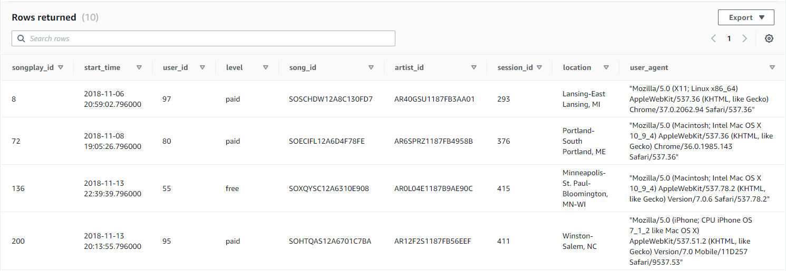

# Building the Sparkify Song Plays Analysis Database

#### Purpose:
Client Sparkify nas changed needs, and is now requesting for a PostgreSQL data warehouse to handle their song plays data for analysis. the client requested that the service be hosted via Amazon Web Services (AWS), with raw data stored in S3 buckets, with the warehousing handled by a redshift cluster.

#### Overview of the Databases and Database Schema:
The schema still shares the 5 table star schema of the previous database, with the addition of two "staging" tables, which serves as an area for processing the data before insertion into the database.

###### staging table: "staging events table"
- A staging table for temporary holding and/or preprocessing data coming from the 'log_data' S3 bucket.
    - columns: se_id, artist, auth (authorization), first_name, gender, item_in_session, last_name, length, level, location, method, page, registration, session_id, song varchar, status, ts (timestamp), user_agent, user_id 

###### staging table: "staging songs table"
- A staging table for temporary holding and/or preprocessing data coming from the 'song_data' S3 bucket.
    - columns: ss_id, num_songs, artist_id, artist_latitude, artist_longitude, artist_location, artist_name, song_id, title, duration, year 

###### fact table: "songplays"
- The fact table supplies the metrics used for the song plays analytics.
    - columns: songplay_id, start_time, user_id, level, song_id, artist_id, session_id, location, user_agent

###### dimension table: "users"
- the registered users in the app.
    - columns: user_id, first_name, last_name, gender, level
    
###### dimension table: "songs" 
- the available songs in the database.
    - columns: song_id, title, artist_id, year, duration
    
###### dimension table: "artists"
- the available artists in the database.
    - columns: artist_id, name, location, latitude, longitude
    
###### dimension table: "time"
- a timestamp record of when a song was played.
    - columns: start_time, hour, day, week, month, year, weekday
    
#### Overview of the ETL Process:

Sparkify provided two sources of data coming from the "song_data" directory, and the "log_data" S3 buckets. The data is in JSON, and need to be taken into account when populating the staging tables. Staging tables are necessary for data warehouses, as they serve as an area to perform checks and data cleaning before insertion.

The ETL process is quite simple to execute:

- prior to running scripts, make sure the buckets and the reshift cluster are running, and that a connection instance can be established with the cluster.
    
- The "sql_queries" python script is populated with the sql statements needed to create the 7 tables, and to insert the    appropriate data from the correct sources.
    
- The "create_tables" script will run the create table squeries in the "sql_queries" file, and create the empty tables 

- The "etl" script will then create a connection instance to the cluster, load the "log_data" and "song_data" into the staging tables, and then distribute the data into the 5 tables accordingly.

#### Query Example:
Running the following query in redshift query editor:

    - SELECT * FROM songplays LIMIT 10;
    
Returns:

      
